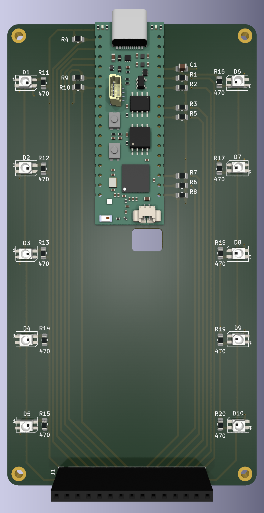
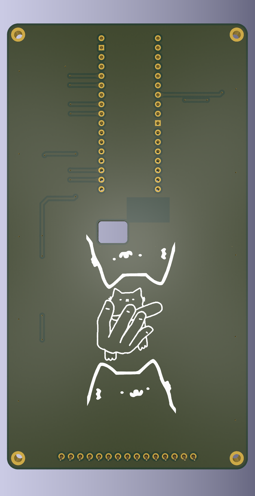

# Documentație Macropad ESP32-S3

Acest document descrie în detaliu proiectul de licență "Macropad ESP32-S3", o tastatură auxiliară programabilă, concepută pentru a spori productivitatea prin scurtături și funcții personalizate.

## 1. Stadiul Proiectului

**Notă importantă:** Acest proiect este în curs de dezvoltare. La momentul redactării acestui document, doar design-ul hardware (fișierele KiCad pentru PCB) este finalizat. Secțiunile de firmware, asamblare și testare reprezintă pașii următori în dezvoltare.

## 2. Prezentare Generală

Macropad-ul este un dispozitiv de intrare compact, construit în jurul microcontrolerului Unexpected Maker ProS3 (bazat pe ESP32-S3). Acesta oferă 12 taste mecanice, un encoder rotativ cu buton și un ecran OLED pentru feedback vizual. Conectivitatea duală, prin USB și Bluetooth, îi conferă flexibilitate maximă, permițând utilizarea atât într-un mediu static (desktop), cât și portabil.

## 3. Caracteristici Tehnice

- **12 Taste Mecanice:** Suportă switch-uri stil MX, montate în socket-uri hot-swappable pentru personalizare facilă.
- **Encoder Rotativ:** Un encoder compatibil EC11 cu buton integrat, destinat navigării prin meniuri, ajustării volumului sau altor funcții programabile.
- **Ecran OLED:** Un display SSD1306 de 0.91" (128x32 pixeli) pentru afișarea informațiilor esențiale:
  - Stratul (layer-ul) activ
  - Starea conexiunii (USB/Bluetooth)
  - Nivelul bateriei
  - Ultima comandă executată
- **Conectivitate Duală:** Comutare între modul USB HID (Human Interface Device) și Bluetooth/BLE HID.
- **Management al Alimentării:** Include un comutator SPDT pentru a trece dispozitivul într-un mod de consum redus (low-power), conservând astfel durata de viață a bateriei.
- **Indicator Baterie:** Un LED NeoPixel integrat pe placa ProS3 va oferi feedback vizual despre starea bateriei.
- **Straturi Programabile:** Firmware-ul va permite definirea a trei straturi (layers) de funcționalități:
  1. **Taste de funcții extinse (F13-F24):** Utile pentru asignarea de scurtături în aplicații specializate (ex: software de editare video, IDE-uri).
  2. **Scurtături comune:** Comenzi uzuale precum `CTRL+C`, `CTRL+V`, `ALT+TAB`.
  3. **Execuție de scripturi:** Lansarea de scripturi sau comenzi complexe printr-o singură apăsare de tastă.

## 4. Componente Hardware

### Componente Principale
- **Placă de dezvoltare:** Unexpected Maker ProS3
- **Encoder Rotativ:** Tip EC11 cu buton
- **Ecran OLED:** SSD1306, 128x32 pixeli, interfață I2C
- **Taste Mecanice:** 12 x socket-uri hot-swap compatibile MX
- **Comutator:** SPDT ON-OFF pentru managementul alimentării

### Componente Pasive
- **Diode:** 1N4148 THT (through-hole) pentru a preveni efectul de "ghosting".
- **Rezistoare:** Pull-up de 10kΩ (format SMD 0805).
- **Condensator:** Decuplare de 100nF (format SMD 0805).

### Bill of Materials (BOM)
O listă detaliată a tuturor componentelor (Bill of Materials) nu este încă disponibilă. Aceasta va fi generată automat folosind extensia "Interactive BOM" din KiCad, după finalizarea și validarea design-ului.

## 5. Design PCB

Proiectul hardware constă din două plăci de circuit imprimat (PCB) interconectate.

### Placa Superioară (Top Board)
Această placă găzduiește toate componentele de interfață cu utilizatorul:
- Cele 12 socket-uri pentru taste, aranjate într-o matrice 3x4.
- Encoderul rotativ.
- Conectorul pentru ecranul OLED.
- Comutatorul de alimentare.

- **Schematic:** [top_schematic.pdf](top_schematic.pdf)
- **Layout:** [top_layout.pdf](top_layout.pdf)

### Placa Inferioară (Bottom Board)
Această placă servește drept placă de bază și conține:
- Microcontrolerul Unexpected Maker ProS3.
- Circuitele de management al alimentării și încărcare a bateriei.
- Diodele și celelalte componente pasive.

- **Schematic:** [bottom_schematic.pdf](bottom_schematic.pdf)
- **Layout:** [bottom_layout.pdf](bottom_layout.pdf)

## 6. Firmware

Firmware-ul pentru acest proiect va fi scris de la zero în C/C++ (folosind Arduino Framework sau ESP-IDF), deoarece soluțiile existente precum QMK/ZMK nu oferă suport nativ pentru microcontrolerul Unexpected Maker ProS3.

Firmware-ul va gestiona:
- Scanarea matricei de taste.
- Citirea encoderului rotativ.
- Afișarea informațiilor pe ecranul OLED.
- Comunicarea prin USB HID și Bluetooth HID.
- Managementul straturilor de taste.
- Monitorizarea tensiunii bateriei și controlul LED-ului NeoPixel.

## 7. Ghid de Asamblare (Hardware)

1. **Comandarea PCB-urilor:** Generați fișierele Gerber din proiectele KiCad și trimiteți-le unui producător.
2. **Lipirea Componentelor Pasive:** Lipiți rezistoarele, condensatorul și diodele pe ambele plăci, conform layout-ului. Se recomandă începerea cu componentele SMD.
3. **Instalarea Socket-urilor:** Montați și lipiți cele 12 socket-uri hot-swap pe placa superioară.
4. **Interconectarea Plăcilor:** Lipiți pinii de legătură (header pins) pentru a conecta placa superioară de cea inferioară.
5. **Montarea Componentelor Principale:**
   - Lipiți placa ProS3 pe placa inferioară.
   - Conectați ecranul OLED și encoderul rotativ la placa superioară.
6. **Asamblarea Finală:** Instalați switch-urile mecanice în socket-uri și adăugați tastele (keycaps).

## 8. Ghid de Utilizare (Funcționalități Planificate)

Următoarele funcționalități sunt propuse pentru versiunea finală a firmware-ului.

- **Pornire/Oprire:** Utilizați comutatorul SPDT. O poziție va alimenta dispozitivul, iar cealaltă îl va trece în modul de consum redus.
- **Comutarea între Straturi (Layers):** Apăsați scurt pe butonul encoderului pentru a cicla între cele trei straturi definite. Stratul activ va fi afișat pe ecranul OLED.
- **Modul de Împerechere (Pairing) Bluetooth:** Apăsați lung (aproximativ 3 secunde) pe butonul encoderului pentru a activa modul de împerechere Bluetooth. Macropad-ul va deveni vizibil pentru alte dispozitive cu numele `Macropad ESP32-S3`.
- **Navigare Meniu:** Rotiți encoderul pentru a naviga prin opțiunile afișate pe ecran (dacă un meniu de configurare va fi implementat).

## 9. Carcasă (Enclosure)

În prezent, proiectul nu include o carcasă. După fabricarea și asamblarea PCB-urilor, se intenționează proiectarea unei carcase 3D-printabile. Fișierele STL vor fi adăugate proiectului la o dată ulterioară.

## 10. Galerie

### Randări PCB
- **Vedere de sus a PCB-ului:**
  - 
  - 
- **Vedere de jos a PCB-ului:**
  - 
  - 

### Referințe
- **Pinout ProS3:** 