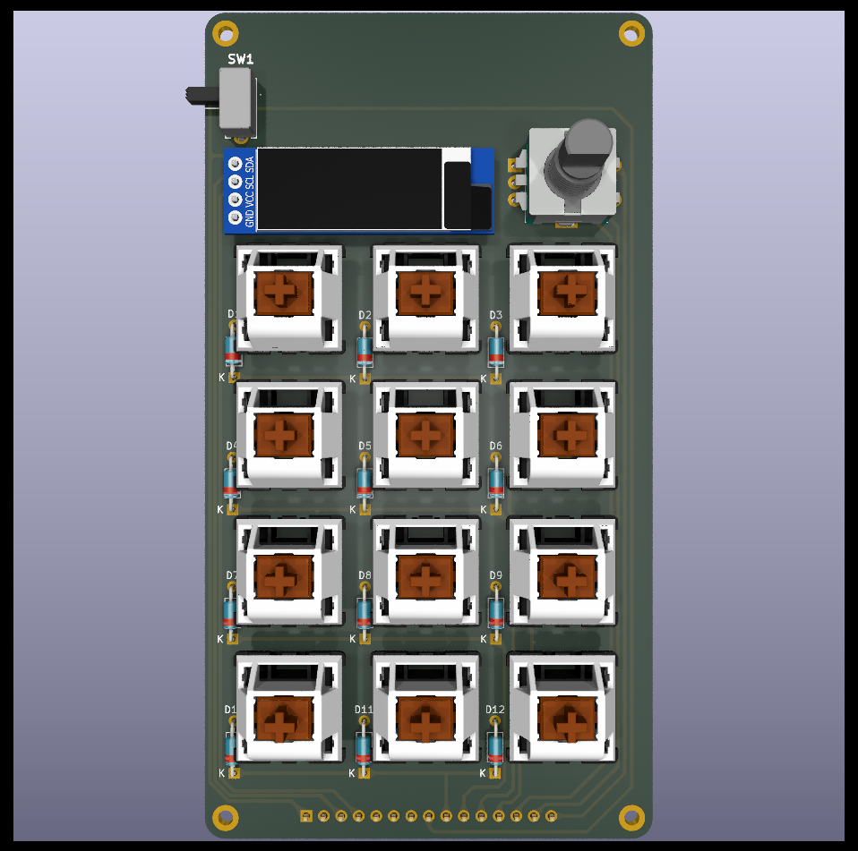
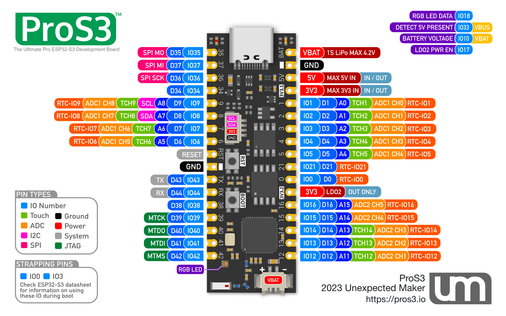
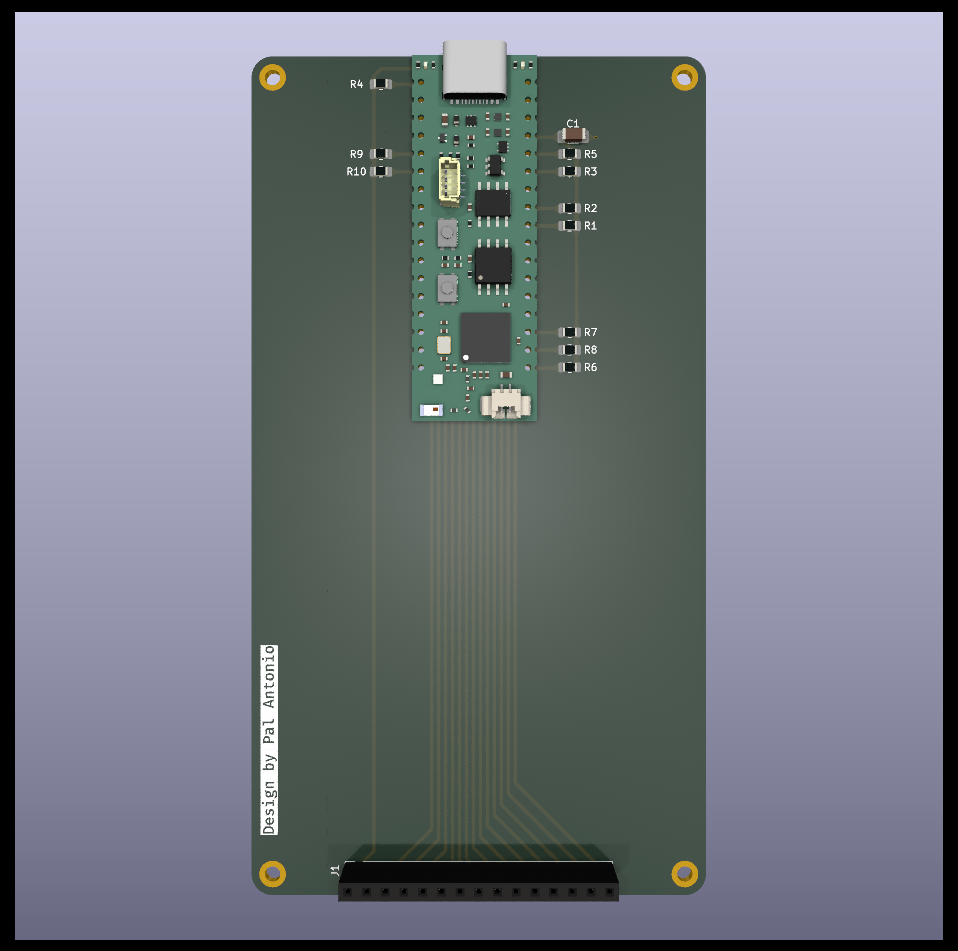

# ESP32 Macropad - Proiect Licență

Un macropad personalizat cu 12 taste mecanice, construit pe baza ESP32-S3, cu taste mecanice programabile, encoder rotativ, display OLED și două moduri de conectivitate (USB/Bluetooth).




## Cuprins

- [Prezentare Generală](#prezentare-generală)
- [Caracteristici](#caracteristici)
- [Componente Hardware](#componente-hardware)
- [Design PCB](#design-pcb)
- [Firmware](#firmware)
- [Conectivitate](#conectivitate)
- [Galerie](#galerie)
- [Licență](#licență)

## Prezentare Generală

Acest proiect este un macropad dedicat productivității, proiectat pentru fluxuri de lucru personalizabile. Construit cu Unexpected Maker ProS3, combină taste mecanice cu funcții inteligente precum monitorizarea bateriei prin LED NeoPixel, un display OLED pentru feedback vizual și comutare fără întreruperi între modurile cu fir și wireless.

## Caracteristici

- **12 Taste Mecanice**: Taste mecanice hot-swappable stil MX
- **Encoder Rotativ**: Encoder compatibil EC11 cu buton pentru controlul volumului și navigarea în meniu
- **Display OLED**: Ecran OLED SSD1306 128x32 (diagonală 0.91") care afișează:
  - Indicatorul nivelului bateriei
  - Informații despre stratul activ
  - Ultima tastă/scurtătură apăsată
  - Starea conexiunii
- **Conectivitate Duală**: Comutare între modurile USB HID și Bluetooth/BLE HID
- **Management Putere**: Switch SPDT pentru modul de consum redus
- **Indicator Baterie**: LED NeoPixel cu stare baterie codificată prin culoare:
  - Verde (>80%): Verde solid
  - Galben-Portocaliu (20-80%): Gradient de culoare
  - Roșu (<20%): Roșu intermitent
- **Trei Straturi Programabile**:
  1. Taste de funcții extinse (F13-F24) pentru scurtături în aplicații
  2. Scurtături comune (CTRL+Z, ALT+TAB, etc.)
  3. Taste pentru execuție scripturi

## Componente Hardware

### Componente Principale

- **Unexpected Maker ProS3**: Placă de dezvoltare bazată pe ESP32-S3 cu USB-C și încărcare baterie integrată
- **Encoder Rotativ**: Encoder compatibil EC11 cu switch integrat
- **Display OLED**: Display OLED SSD1306 128x32 I2C
- **Taste Mecanice**: 12x socket-uri hot-swap compatibile MX
- **Switch SPDT**: Switch ON-OFF pentru managementul puterii

### Componente Pasive

- **Diode**: Diode THT 1N4148 cu comutare rapidă pentru protecție anti-ghosting
- **Rezistoare Pull-up**: Rezistoare SMD 0805 de 10kΩ
- **Condensator de Decuplare**: Condensator SMD 1206 de 100nF

### Referință Pini



## Design PCB

Proiectul constă într-un design PCB cu două straturi, creat în KiCad:

### Placa de Sus (Control Principal)

Placa superioară găzduiește componentele interfeței cu utilizatorul:

- 12 socket-uri pentru taste mecanice în layout matrice 3x4
- Poziție encoder rotativ
- Conector display OLED
- Switch selectare mod
- Pini header pentru conectare la placa de jos


### Placa de Jos (Controler)

Placa inferioară conține controlerul principal și managementul puterii:

- Footprint Unexpected Maker ProS3
- Circuiterie monitorizare baterie
- Componente reglare tensiune
- Diode de protecție
- Găuri de montare pentru asamblare




## Firmware

### Monitorizare Baterie

Firmware-ul include monitorizarea inteligentă a bateriei cu feedback vizual prin LED-ul NeoPixel integrat:

```cpp
// Praguri tensiune baterie pentru LiPo 3.7V
const float VOLTAGE_FULL = 4.20;  // 100%
const float VOLTAGE_EMPTY = 3.30; // 0%
```

**Indicatori Culoare:**

- **Verde**: Nivel baterie peste 80%
- **Gradient (Verde→Galben→Roșu)**: Nivel baterie între 20-80%
- **Roșu Intermitent**: Nivel baterie sub 20% (critic)

Sistemul citește tensiunea bateriei prin pinul analog A13 și actualizează starea LED-ului în fiecare secundă.

### Dependențe

- `Adafruit_NeoPixel`: Pentru controlul LED-ului RGB

## Conectivitate

Macropad-ul suportă două protocoale principale de comunicare:

### USB HID

- Conexiune USB standard prin port USB-C
- Latență redusă, fără necesitatea asocierii
- Potrivit pentru utilizare desktop/workstation

### Bluetooth/BLE HID

- Conectivitate wireless pentru utilizare portabilă
- Suportă asocierea cu multiple dispozitive
- Funcționare pe baterie

Utilizatorii pot comuta între moduri folosind encoderul rotativ și pot monitoriza conexiunea activă pe display-ul OLED.

## Galerie

### Design-uri PCB


_PCB Superior - Vedere frontală arătând layout-ul tastelor și plasarea componentelor_


_PCB Superior - Vedere spate arătând pistele și conexiunile_


_PCB Inferior - Placă controler cu footprint ProS3_

### Схеме

- [Schemă Placă Superioară](Documentatie/top_schematic.pdf)
- [Schemă Placă Inferioară](Documentatie/bottom_schematic.pdf)

### Layout-uri PCB

- [Layout Placă Superioară](Documentatie/top_layout.pdf)
- [Layout Placă Inferioară](Documentatie/bottom_layout.pdf)

## Structura Proiectului

```
Proiect-Licenta/
├── Code/
│   └── battery_neopixel/
│       └── battery_neopixel.ino      # Firmware monitorizare baterie
├── Documentatie/
│   ├── Documentatie.md                # Documentație proiect (Română)
│   ├── ProS3_Pin_Reference.png       # Referință pinout ESP32-S3
│   ├── top_pcb_1.png                 # Randare PCB superior (față)
│   ├── top_pcb_2.png                 # Randare PCB superior (spate)
│   ├── bottom_pcb.png                # Randare PCB inferior
│   ├── top_schematic.pdf             # Schemă placă superioară
│   ├── bottom_schematic.pdf          # Schemă placă inferioară
│   ├── top_layout.pdf                # Layout placă superioară
│   └── bottom_layout.pdf             # Layout placă inferioară
├── kicad/
│   ├── top/                          # Fișiere proiect KiCad PCB superior
│   └── bottom/                       # Fișiere proiect KiCad PCB inferior
└── scottokeebs_kicad_libs/           # Biblioteci KiCad personalizate pentru tastaturi mecanice
```

## Primii Pași

### Asamblare Hardware

1. Comandați PCB-uri folosind fișierele gerber din proiectul KiCad
2. Lipire componente pasive (diode, rezistoare, condensatoare) pe ambele plăci
3. Instalare socket-uri hot-swap pe placa superioară
4. Lipire pini header între plăcile superioară și inferioară
5. Montare ProS3 pe placa inferioară
6. Conectare display OLED și encoder rotativ
7. Instalare taste mecanice

### Încărcare Firmware

1. Instalare Arduino IDE cu suport pentru plăci ESP32
2. Instalare biblioteci necesare:
   - Adafruit NeoPixel
3. Deschidere `Code/battery_neopixel/battery_neopixel.ino`
4. Selectare "Unexpected Maker ProS3" ca placă
5. Încărcare firmware

### Configurare Software

_Firmware pentru funcționalitatea tastaturii în curând_

## Contribuții

Acesta este un proiect de licență universitară. Sugestii și feedback sunt binevenite!

## Licență

Acest proiect include componente de la [ScottoKeebs](https://github.com/joe-scotto/scottokeebs), care sunt utilizate sub licențele lor respective.

## Mulțumiri

- [Unexpected Maker](https://unexpectedmaker.com/) pentru placa ProS3
- [ScottoKeebs](https://github.com/joe-scotto/scottokeebs) pentru bibliotecile KiCad și footprint-urile pentru tastaturi
- Comunitatea de tastaturi mecanice pentru inspirație și resurse

---

**Stare Proiect**: În Dezvoltare

_Creat ca parte a unui proiect de licență_
