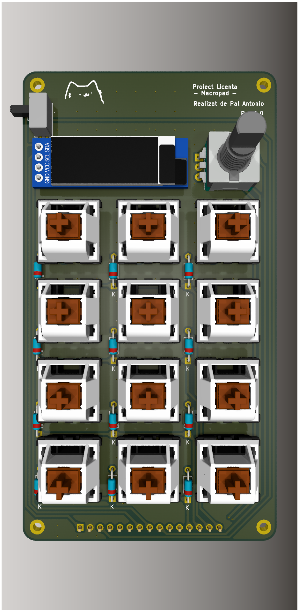
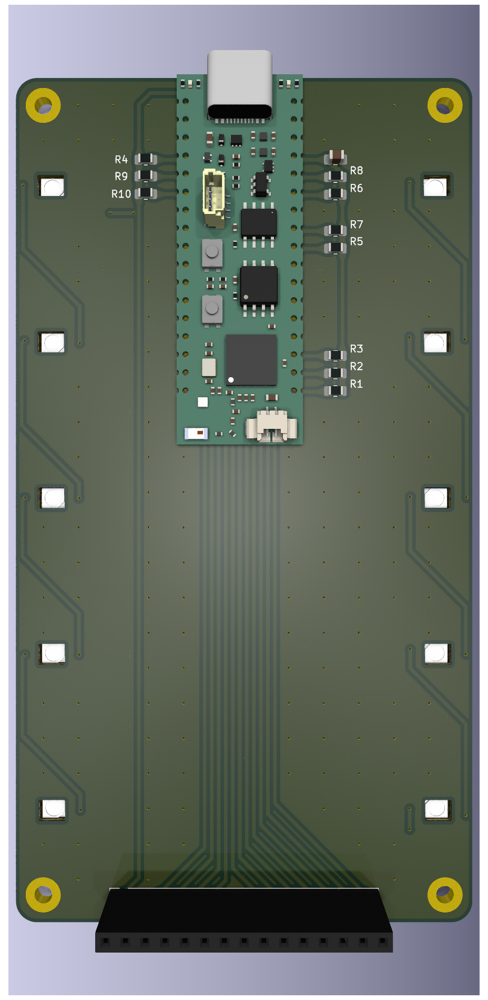
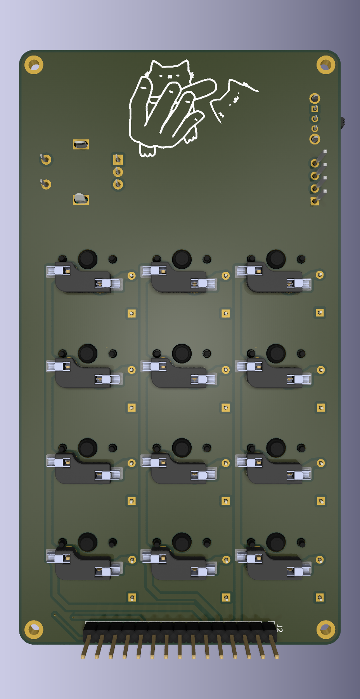
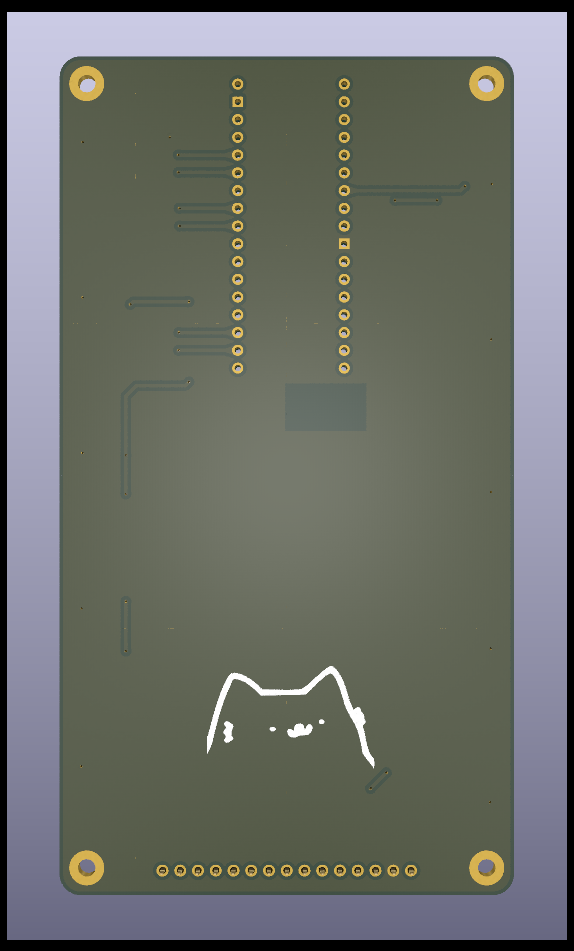

# ESP32-S3 Macropad - Thesis Project

A custom 12-key mechanical macropad based on the ESP32-S3, featuring programmable keys, a rotary encoder, an OLED display, and dual-mode connectivity (USB/Bluetooth).

## Gallery

|                       Top View                       |                        Bottom View                         |
| :--------------------------------------------------: | :--------------------------------------------------------: |
|                |                |
|  |  |

---

## About This Project

This repository contains the full engineering stack (Hardware, Firmware, and Software) for a versatile and programmable macropad created as a university thesis project. It allows users to create custom shortcuts, macros, and function layers to streamline their workflows.

**For detailed technical documentation, please see the [Documentation File](docs/Documentatie.md) (Romanian).**

## Project Structure

The repository is organized into four main engineering domains:

- **`hardware/`**: Contains the KiCad PCB designs (`pcb/`) and 3D enclosure files (`case/`).
- **`firmware/`**: The C++/Arduino code running on the ESP32-S3 microcontroller.
- **`web-configurator/`**: A browser-based UI for customizing key layouts and layers.
- **`host-listener/`**: A Python application that runs on the PC to execute advanced commands (opening apps, running scripts).

## Features

- **12 Hot-Swappable Mechanical Keys:** Customize the feel of your macropad with any MX-style switches.
- **Rotary Encoder:** Includes a push-button for intuitive menu navigation, volume control, and more.
- **OLED Display:** A 0.91" SSD1306 screen provides real-time feedback on active layers, connection status, and battery level.
- **Web-Based Configuration:** Easily remap keys, create macros, and set up layers using a visual drag-and-drop interface—no coding required.
- **Advanced Host Integration:** Triggers custom PC scripts and application launches via a Python listener.
- **Dual Connectivity:** Seamlessly switch between a wired USB-C connection and wireless Bluetooth/BLE HID.

## The Software Ecosystem

This project uses a 3-part architecture to handle configuration:

### 1. Web Configurator

Located in [`web-configurator/`](web-configurator/), this is a standalone HTML/JS application.

- Visualizes the 4-layer architecture (F-Keys, Shortcuts, Commands, Launcher).
- Generates a `config.json` file containing your custom layout.
- Supports local storage auto-save and importing previous configs.

### 2. Host Listener

Located in [`host-listener/`](host-listener/), this Python script runs in the background on your computer (Windows/Linux/macOS).

- Detects the `config.json` file generated by the web tool.
- Listens for specific data commands sent by the Macropad over USB Serial.
- Executes complex tasks that a keyboard cannot do alone (e.g., "Open Chrome", "Run Deploy Script").

### 3. Firmware

Located in [`firmware/`](firmware/), written in C++ for the ESP32-S3.

- Handles the physical matrix scanning and OLED rendering.
- Acts as a standard HID Keyboard for Layers 1 & 2.
- Acts as a Serial Device for Layers 3 & 4 (communicating with the Host Listener).

## Hardware Overview

- **Microcontroller:** Unexpected Maker ProS3 (ESP32-S3)
- **Design:** A two-board design separates the user interface components (keys, encoder) from the main controller board.
- **Components:**
  - 12x MX-compatible hot-swap sockets
  - EC11-compatible rotary encoder
  - SSD1306 128x32 I2C OLED display
  - 1N4148 diodes for anti-ghosting

The full schematics and PCB layouts are located in the [`hardware/pcb`](hardware/pcb) folder.

## Getting Started

1.  **Fabricate PCBs:** Use the KiCad files in `hardware/pcb` to generate Gerbers and order the PCBs.
2.  **Assemble Hardware:** Solder the components according to the PCB layout. A detailed assembly guide is available in the [documentation](docs/Documentatie.md).
3.  **Flash Firmware:** Flash the code from the `firmware/` folder onto the ProS3 board.
4.  **Configure:** Open the Web Configurator (hosted via GitHub Pages or locally), design your layers, and export the JSON.
5.  **Run Listener:** Start the Python Host Listener to sync your configuration and enable advanced features.

## Acknowledgements

- **[Unexpected Maker](https://unexpectedmaker.com/)** for the excellent ProS3 board.
- **[ScottoKeebs](https://github.com/joe-scotto/scottokeebs)** for the KiCad libraries and footprints for mechanical keyboards.
- The mechanical keyboard community for endless inspiration.

## License

The hardware design files are provided as-is. This project includes components from third-party libraries which are subject to their own licenses.
