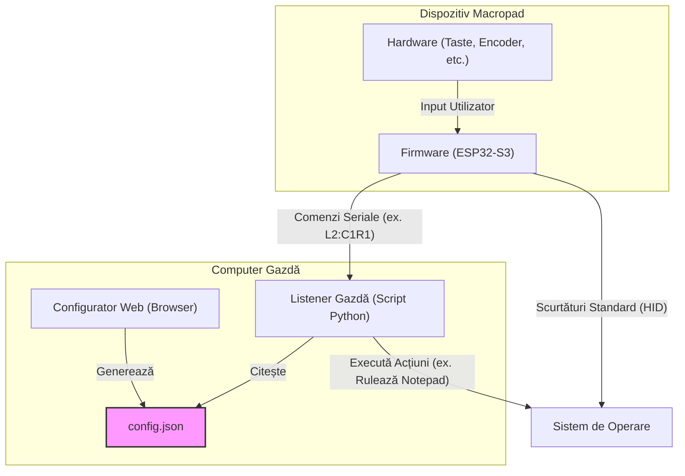

# Documentație Tehnică Completă - Macropad PROS3

Acest document oferă o privire detaliată, "fără nicio piatră neîntoarsă", asupra componentelor hardware, firmware și software care alcătuiesc proiectul Macropad PROS3. Este destinat dezvoltatorilor, pasionaților de electronică și oricui dorește să construiască, să personalizeze sau să înțeleagă pe deplin ingineria din spatele proiectului.

---

## 1. Arhitectura Sistemului

Proiectul este un ecosistem complet, compus din trei părți distincte, dar interconectate: **Hardware**, **Firmware** și o **Suită Software** pentru configurare și interacțiune cu computerul gazdă.

Conceptul de bază este că macropad-ul poate acționa ca un dispozitiv HID simplu (precum o tastatură standard) pentru scurtături de bază, dar poate, de asemenea, să trimită comenzi specializate către o aplicație de ascultare (listener) pe computerul gazdă pentru a efectua sarcini mai complexe, cum ar fi lansarea de aplicații sau rularea de scripturi.



### Cei Trei Piloni

1.  **Hardware (Dispozitivul Fizic):** Un ansamblu PCB personalizat, format din două plăci, cu 12 taste hot-swap, un encoder rotativ, un ecran OLED și iluminare de fundal RGB.
2.  **Firmware (C++ Embedded):** Codul care rulează pe microcontrolerul ESP32-S3. Acesta scanează hardware-ul pentru input, gestionează afișajul și iluminarea și comunică cu computerul gazdă prin USB sau Bluetooth.
3.  **Suita Software (Configurare & Control):**
    *   **Configurator Web:** O interfață grafică (GUI) bazată pe browser care permite unui utilizator să definească mapările tastelor, să creeze macrouri și să personalizeze iluminarea, exportând rezultatele într-un fișier `config.json`.
    *   **Listener Gazdă:** Un script Python care rulează pe computerul utilizatorului. Acesta ascultă comenzi speciale de la firmware și folosește `config.json` pentru a le traduce în acțiuni, cum ar fi rularea unui program sau a unui script shell.

---

## 2. Analiză Hardware Detaliată

Hardware-ul este proiectat pentru a fi atât funcțional, cât și ușor de asamblat pentru pasionați. Acesta constă dintr-o placă "superioară" pentru componentele de interfață cu utilizatorul și o placă "inferioară" pentru sistemele logice și de alimentare.

### Bill of Materials (BOM) - Lista de Componente

#### Placa Superioară (Interfață Utilizator)

| Nume Componentă    | Cant. | Specificație / Valoare | Amprentă / Detaliu       | Scop / Funcție                                                          |
| :----------------- | :---: | :--------------------- | :----------------------- | :---------------------------------------------------------------------- |
| **Switch Tastatură** |  12   | Switch Tactil          | `MX_Hotswap_1.00u`       | **Input Utilizator:** Oferă o conexiune electrică momentană.            |
| **Diodă**          |  12   | 1N4148                 | `D_DO-35_SOD27`          | **Protecție Matrice:** Previne "ghosting-ul".                           |
| **Encoder Rotativ**|   1   | EC11 cu buton          | `Encoder_EC11_MX`        | **Input Utilizator:** Input rotațional continuu și buton.                 |
| **Ecran OLED**     |   1   | SSD1306 128x32         | `OLED_128x32`            | **Afișaj:** Afișează straturi, status baterie și informații de conectare.|
| **Comutator SPDT** |   1   | Comutator glisant      | `SLW8645745ARAND`        | **Selecție Mod:** Comutator fizic pentru On/Off sau schimbare mod.        |
| **Conector Pin**   |   1   | 1x15 Male Header       | `PinHeader_1x15_Vertical`| **Conexiune:** Conectează placa superioară de cea inferioară.             |

#### Placa Inferioară (Logică & Alimentare)

| Nume Componentă          | Cant. | Specificație / Valoare | Amprentă / Detaliu        | Scop / Funcție                                                              |
| :----------------------- | :---: | :--------------------- | :------------------------ | :-------------------------------------------------------------------------- |
| **Socket Pin**           |   1   | 1x15 Female Socket     | `PinSocket_1x15_Vertical` | **Conexiune:** Se cuplează cu placa superioară pentru un ansamblu modular.  |
| **Microcontroler**       |   1   | UM ESP32-S3 Pro        | `DU1 / ProS3_TH`          | **Procesor Principal:** Execuție firmware, I/O și radio WiFi/BLE.           |
| **Antenă**               |   1   | 2.4 GHz Flexibilă      | `AC10200-100` / U.FL      | **Wireless:** Transmite și recepționează semnale Bluetooth/WiFi.              |
| **LED RGB**              |  10   | SK6812MINI             | `PLCC4_3.5x3.5mm`         | **Iluminare:** Iluminare de fundal adresabilă, full-color.                  |
| **Rezistor Pull-Up**     |  10   | 10k $\Omega$           | `R_0805_HandSolder`       | **Stabilizare:** Asigură că pinii de input rămân într-o stare logică ridicată.|
| **Rezistor Limitare**    |  10   | 470 $\Omega$           | `R_0805_HandSolder`       | **Protecție:** Limitează curentul către LED-uri sau linii de date.          |
| **Capacitor**            |   1   | 100nF                  | `C_0805_HandSolder`       | **Decuplare:** Filtrează zgomotul electric în apropierea pinilor de alimentare.|

### Scheme Electrice & Layout

Fișierele de proiectare KiCad complete se găsesc în directorul [`hardware/pcb/`](../hardware/pcb/). Pentru referință rapidă, sunt disponibile și exporturi PDF ale schemelor și layout-urilor:

*   **Placa Superioară:**
    *   [Schematic (`schematic-top.pdf`)](schematics/schematic-top.pdf)
    *   [Layout (`layout-top.pdf`)](schematics/layout-top.pdf)
*   **Placa Inferioară:**
    *   [Schematic (`schematic-bottom.pdf`)](schematics/schematic-bottom.pdf)
    *   [Layout (`layout-bottom.pdf`)](schematics/layout-bottom.pdf)

---

## 3. Analiză Firmware Detaliată

Firmware-ul este dezvoltat folosind C++ în mediul PlatformIO, care oferă un lanț de unelte (toolchain) robust și extensibil pentru ESP32-S3.

### Funcționalități de Bază

-   **Procesare Input:** Scanează matricea de taste 3x4 și encoderul rotativ pentru evenimente (apăsare, eliberare, rotire, click).
-   **Gestionare Straturi (Layers):** Administrează stratul de mapare a tastelor activ. Click-ul pe encoder comută între cele 4 straturi.
-   **Gestionare Afișaj:** Utilizează biblioteca U8g2 pentru a desena informații pe ecranul OLED, cum ar fi numele stratului curent și mesaje de stare.
-   **Gestionare Iluminare:** Controlează cele 10 LED-uri RGB adresabile folosind biblioteca FastLED.
-   **Comunicație:**
    -   **USB HID:** Pentru straturile 0 și 1, acționează ca o tastatură USB standard, trimițând apăsări de taste și comenzi media (cum ar fi Volum Sus/Jos) care sunt înțelese de orice sistem de operare modern fără drivere.
    -   **USB Serial:** Pentru straturile 2 și 3, trimite o comandă simplă sub formă de șir de caractere prin portul serial (de ex., `L2:C0R1`) pentru a fi interpretată de Listener-ul Gazdă. Portul serial este folosit și pentru mesaje de debugging.

### Sistemul de Straturi (Layers)

Firmware-ul implementează 4 straturi funcționale distincte. Stratul activ determină ce acțiune este efectuată la apăsarea unei taste.

-   **Strat 0 (Taste FN):** Hardcodat în firmware. Acest strat trimite tastele funcționale F13 până la F24, care sunt taste non-standard, adesea folosite pentru scurtături specifice aplicațiilor pentru a evita conflictele cu tastele standard de sistem.
-   **Strat 1 (Scurtături):** Acest strat este proiectat pentru a trimite scurtături HID complexe (de ex., `Ctrl+Shift+P`). Firmware-ul parsează `config.json` pentru a trimite combinația corectă de taste modificatoare și taste standard. *(Notă: Parsarea completă este în dezvoltare).*
-   **Strat 2 (Comenzi):** Când o tastă este apăsată pe acest strat, firmware-ul trimite un șir de identificare unic pentru acea tastă prin portul serial USB (de ex., `L2:C0R0`). Acesta **nu** trimite o comandă de tastatură. Listener-ul Gazdă trebuie să ruleze pentru a recepționa acest mesaj și a executa comanda asociată.
-   **Strat 3 (Lansator):** Identic ca mecanism cu Stratul 2, dar folosește un prefix diferit (de ex., `L3:C0R0`). Acest lucru permite utilizatorului să-și organizeze acțiunile semantic (de ex., folosind Stratul 2 pentru scripturi și Stratul 3 pentru lansarea de aplicații).

---

## 4. Analiză Suită Software

### Configuratorul Web

Configuratorul, localizat în [`web-configurator/`](../web-configurator/), este o aplicație statică HTML, CSS și JavaScript care poate fi rulată direct din sistemul de fișiere sau de pe un server web simplu.

-   **Scop:** Oferă o modalitate prietenoasă, fără cod, de a defini comportamentul macropad-ului.
-   **Funcționalități:**
    -   O reprezentare vizuală a layout-ului macropad-ului.
    -   Configurarea etichetelor și acțiunilor tastelor pentru fiecare dintre cele 4 straturi.
    -   Personalizarea efectelor de iluminare RGB, a culorii și a luminozității.
    -   Import/Export al configurației ca un singur fișier `config.json`.
    -   Setările sunt salvate automat în LocalStorage-ul browser-ului.

### Listener-ul Gazdă (Host Listener)

Aceasta este componenta critică ce deblochează întreaga putere a macropad-ului. Scriptul, `host-listener/listener.py`, rulează în fundal pe computerul gazdă.

-   **Scop:** Să asculte comenzi seriale de la macropad (trimise de la straturile 2 și 3) și să execute acțiuni pe sistemul de operare gazdă.
-   **Cum funcționează:**
    1.  Scriptul scanează continuu pentru o conexiune serială activă cu macropad-ul.
    2.  Încarcă fișierul `config.json` în memorie pentru a înțelege ce înseamnă fiecare comandă.
    3.  Când primește o comandă (de ex., `L2:C1R2`), caută acțiunea corespunzătoare în datele de configurare încărcate.
    4.  Apoi execută acea acțiune. Aceasta poate fi deschiderea unei adrese URL, rularea unei comenzi shell sau lansarea unei aplicații (`.exe`, `.app`, etc.).
-   **Dependențe:** Scriptul necesită `pyserial` și alte biblioteci. Acestea pot fi instalate prin pip:
    ```bash
    pip install -r host-listener/requirements.txt
    ```

---

## 5. Flux de Utilizare Complet

Acest ghid descrie procesul complet, de la asamblare la funcționalitate deplină.

1.  **Construirea Hardware-ului:** Fabricați PCB-urile folosind fișierele KiCad furnizate și procurați toate componentele din BOM. Asamblați placa superioară și cea inferioară folosind distanțiere M2.5.
2.  **Flash Firmware:**
    -   Instalați Visual Studio Code cu extensia PlatformIO.
    -   Deschideți directorul `firmware/` în VSCode.
    -   Conectați macropad-ul la computer prin USB-C.
    -   Folosiți task-ul "Upload" din PlatformIO pentru a compila și a încărca firmware-ul pe ESP32-S3.
3.  **Crearea unei Configurații:**
    -   Deschideți fișierul `web-configurator/index.html` în browser.
    -   Proiectați-vă layout-urile. Atribuiți funcții tastelor pe straturile 1, 2 și 3. Setați iluminarea dorită.
    -   Apăsați butonul "Export JSON" pentru a descărca fișierul `config.json`. Salvați-l într-o locație cunoscută (de ex., `Documents/Macropad/config.json`).
4.  **Rularea Listener-ului Gazdă:**
    -   Deschideți un terminal sau o linie de comandă.
    -   Navigați la directorul `host-listener/`.
    -   Instalați pachetele Python necesare: `pip install -r requirements.txt`.
    -   Rulați aplicația listener: `python listener.py`.
    -   La prima rulare a scriptului, va apărea fereastra sa. Apăsați "Browse..." și localizați fișierul `config.json` pe care l-ați salvat la pasul anterior. Aplicația va memora această locație pentru rulările viitoare.
    -   Aplicația se va conecta automat la macropad. Acum puteți minimiza fereastra, iar aceasta va rula în system tray.
5.  **Utilizarea Macropad-ului:** Sunteți gata. Macropad-ul va executa acum acțiunile pe care le-ați definit. Apăsările de taste pe straturile 0/1 vor funcționa instantaneu. Apăsările de taste pe straturile 2/3 vor funcționa atâta timp cât Listener-ul Gazdă rulează.
