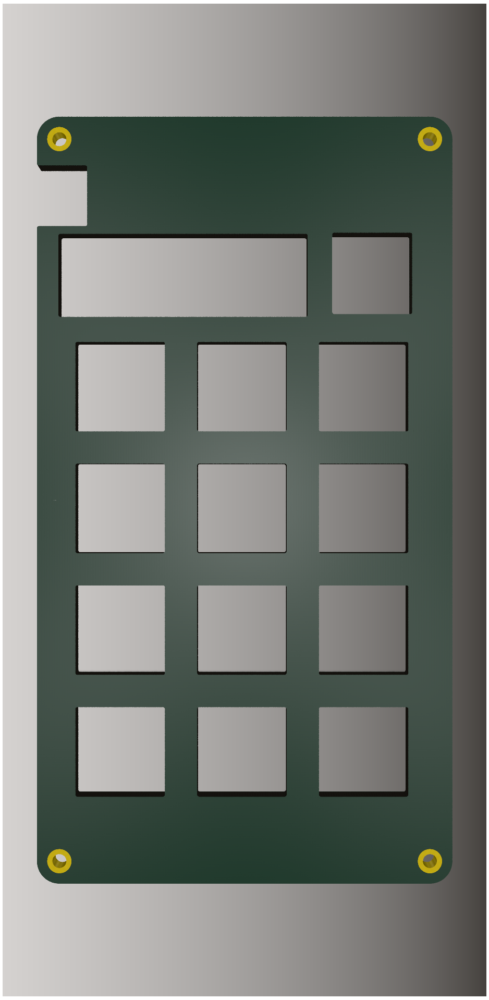
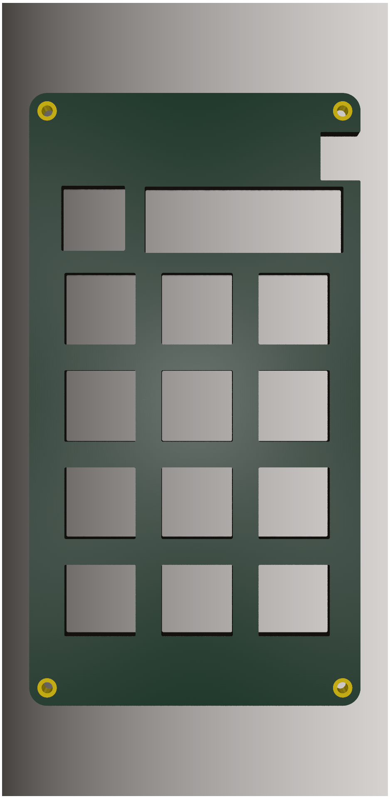
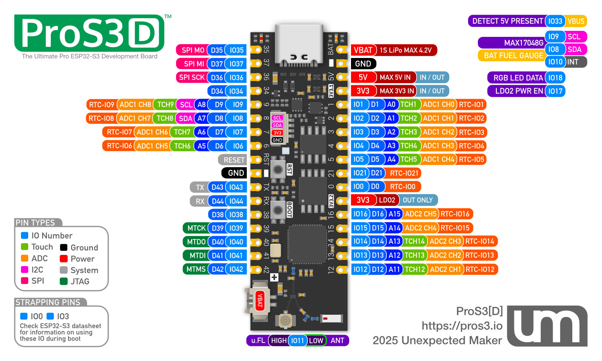
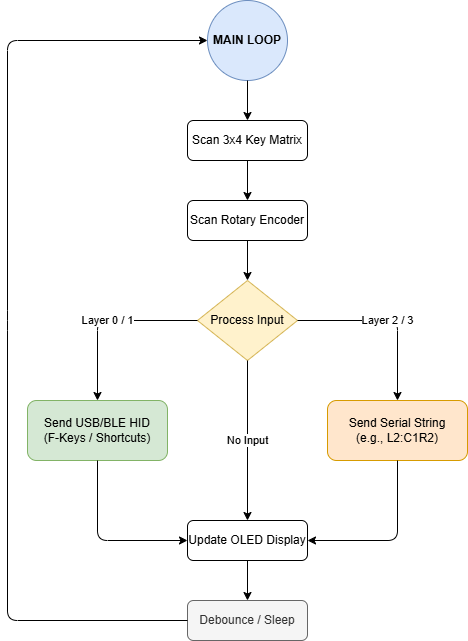
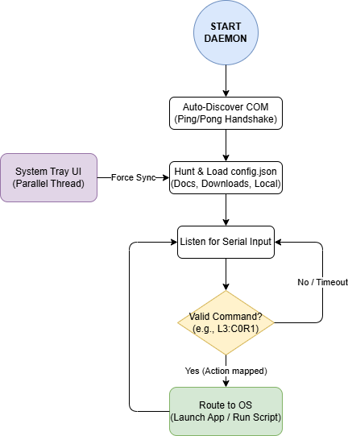
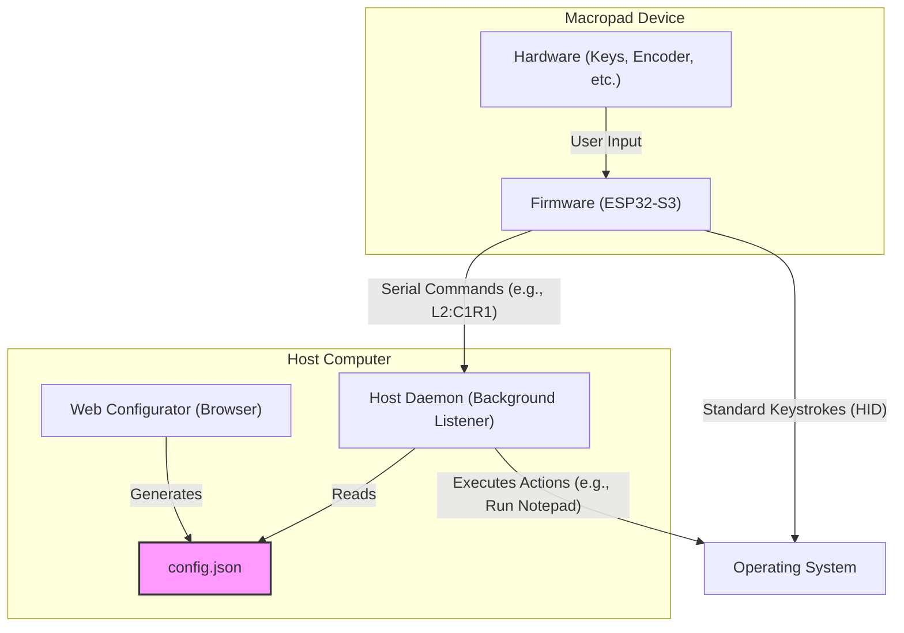

# PROS3 Macropad - Full Technical Documentation

This document provides a detailed, "leave-no-stone-unturned" look into the hardware, firmware, and software that make up the PROS3 Macropad project. It's intended for developers, hobbyists, and anyone looking to build, customize, or fully understand the project's engineering.

---

## Gallery

A compact visual overview of the hardware renders, workflow diagrams, and pinout reference.

|                 Top View                 |                  Bottom View                   |
| :--------------------------------------: | :--------------------------------------------: |
|  |  |

|                       Top Angle                        |                         Bottom Angle                         |
| :----------------------------------------------------: | :----------------------------------------------------------: |
|  |  |

|                Plate View                |                      Plate Angle                       |                  Pinout                   |
| :--------------------------------------: | :----------------------------------------------------: | :---------------------------------------: |
|  |  |  |

|                   Hardware Loop                    |                   Software Loop                    |
| :------------------------------------------------: | :------------------------------------------------: |
|  |  |

## 1. System Architecture

The project is a complete ecosystem composed of three distinct but interconnected parts: **Hardware**, **Firmware**, and a **Software Suite** for configuration and host interaction.

The core concept is that the macropad can act as a simple HID device (like a standard keyboard) for basic shortcuts, but can also send specialized commands to a background listener application on the host computer to perform more complex tasks, like launching applications or running scripts.

### The Three Pillars

1. **Hardware (The Physical Device):** A custom-designed two-part PCB assembly featuring 12 hot-swappable keys, a rotary encoder, an OLED screen, and RGB underglow.
2. **Firmware (Embedded C++):** The code running on the ESP32-S3 microcontroller. It scans the hardware for input, manages the display and lighting, and communicates with the host computer over USB or Bluetooth.
3. **Software Suite (Configuration & Control):**

- **Web Configurator:** A static, browser-based GUI that allows a user to visually define key mappings, create macros, and customize lighting, exporting the results as a `config.json` file.
- **Host Daemon:** A Python-based headless background application that runs on the user's computer. It listens for special commands from the firmware and uses the `config.json` to translate them into OS-level actions via a system tray UI.

---

## 2. Hardware Deep Dive

The hardware is designed to be both functional and easy to assemble for hobbyists. It consists of a "top" board for user interface components and a "bottom" board for the logic and power systems.

### Bill of Materials (BOM)

#### Top Board (User Interface)

| Component Name     | Qty | Value / Specification | Footprint / Part Detail   | Purpose / Function                                                            |
| ------------------ | --- | --------------------- | ------------------------- | ----------------------------------------------------------------------------- |
| **Keyswitch**      | 12  | Tactile Switch        | `MX_Hotswap_1.00u`        | **User Input:** Provides momentary electrical connection for key presses.     |
| **Diode**          | 12  | 1N4148                | `D_DO-35_SOD27`           | **Matrix Protection:** Prevents "ghosting" and ensures current flows one way. |
| **Rotary Encoder** | 1   | EC11 w/ Switch        | `Encoder_EC11_MX`         | **User Input:** Continuous rotational input and momentary push-button.        |
| **OLED Display**   | 1   | SSD1306 128x32        | `OLED_128x32`             | **Display Output:** Shows layers, battery status, and connection info.        |
| **SPDT Switch**    | 1   | Slide Switch          | `SLW8645745ARAND`         | **Mode Selection:** Hard switch for On/Off or Mode toggling.                  |
| **Pin Header**     | 1   | 1x15 Male Header      | `PinHeader_1x15_Vertical` | **Connection:** Connects the Top Board to the Bottom Board.                   |

#### Bottom Board (Logic & Power)

| Component Name        | Qty | Value / Specification | Footprint / Part Detail   | Purpose / Function                                                              |
| --------------------- | --- | --------------------- | ------------------------- | ------------------------------------------------------------------------------- |
| **Pin Socket**        | 1   | 1x15 Female Socket    | `PinSocket_1x15_Vertical` | **Connection:** Mates with the Top Board for a modular assembly.                |
| **Microcontroller**   | 1   | UM ESP32-S3 Pro       | `DU1 / ProS3_TH`          | **Main Processor:** Firmware execution, I/O, and WiFi/BLE radio.                |
| **Antenna**           | 1   | 2.4 GHz Flexible      | `AC10200-100` / U.FL      | **Wireless:** Transmits and receives Bluetooth/WiFi signals.                    |
| **RGB LED**           | 10  | SK6812MINI            | `PLCC4_3.5x3.5mm`         | **Visuals:** Addressable, full-color underglow lighting.                        |
| **Pull-Up Resistor**  | 10  | 10k $\Omega$          | `R_0805_HandSolder`       | **Stabilization:** Ensures input pins stay at a high logic state when inactive. |
| **Limiting Resistor** | 10  | 470 $\Omega$          | `R_0805_HandSolder`       | **Protection:** Limits current flow to LEDs or data lines.                      |
| **Capacitor**         | 1   | 100nF                 | `C_0805_HandSolder`       | **Decoupling:** Filters electrical noise near the power pins.                   |

### ESP32-S3 Pin Assignment

The table below maps every signal to its ESP32-S3 GPIO and the corresponding physical pin on the UM ProS3 module.

| Signal         | GPIO | ProS3 Pin | RTC Wake | Function                            |
| -------------- | ---- | --------- | -------- | ----------------------------------- |
| **COL0**       | 36   | 32        | No       | Key matrix column 0                 |
| **COL1**       | 37   | 33        | No       | Key matrix column 1                 |
| **COL2**       | 35   | 34        | No       | Key matrix column 2                 |
| **ROW0**       | 12   | 17        | Yes      | Key matrix row 0                    |
| **ROW1**       | 13   | 16        | Yes      | Key matrix row 1                    |
| **ROW2**       | 14   | 15        | Yes      | Key matrix row 2                    |
| **ROW3**       | 5    | 9         | Yes      | Key matrix row 3                    |
| **ENC_SW**     | 1    | 5         | Yes      | Rotary encoder push-button          |
| **ENC_CLK**    | 2    | 6         | Yes      | Rotary encoder clock (A)            |
| **ENC_DT**     | 4    | 8         | Yes      | Rotary encoder data (B)             |
| **OLED_SDA**   | 8    | 29        | Yes      | I²C SDA — SSD1306 OLED              |
| **OLED_SCL**   | 9    | 30        | Yes      | I²C SCL — SSD1306 OLED              |
| **RGB_LEDS**   | 7    | 28        | Yes      | SK6812MINI addressable LED data     |
| **BT_SELECT**  | 34   | 31        | No       | BLE / USB mode slide switch         |
| **VBUS_SENSE** | 21   | 10        | Yes      | USB 5 V detection (wake-up capable) |
| **LED_STATUS** | 16   | 13        | Yes      | On-board status LED                 |

> **Note on sleep:** All GPIOs support interrupts and light-sleep wake. Only RTC-capable GPIOs (0–21) can wake from deep sleep. The column pins (35–37) and BT*SELECT (34) are \_not* RTC GPIOs; for deep-sleep wake, drive columns high and use the row pins as wake sources.

### Schematics & Layout

The full KiCad design files are located in the [`hardware/pcb/`](../hardware/pcb/) directory. For quick reference, PDF exports of the schematics and layouts are also available:

- **Top Board:**
- [Schematic (`schematic-top.pdf`)](schematics/schematic-top.pdf)
- [Layout (`layout-top.pdf`)](schematics/layout-top.pdf)

- **Bottom Board:**
- [Schematic (`schematic-bottom.pdf`)](schematics/schematic-bottom.pdf)
- [Layout (`layout-bottom.pdf`)](schematics/layout-bottom.pdf)

---

## 3. Firmware Deep Dive

The firmware is built using C++ in the PlatformIO environment, which provides a robust and extensible toolchain for the ESP32-S3.

### Core Functionality

- **Input Handling:** Scans the 3x4 key matrix and the rotary encoder for events (press, release, turn, click).
- **Layer Management:** Manages the currently active keymap layer. The rotary encoder click cycles through the 4 layers.
- **Display Management:** Uses the U8g2 library to draw information on the OLED screen, such as the current layer name and status messages.
- **Lighting Management:** Controls the 10 addressable RGB LEDs using the FastLED library.
- **Communication:**
- **USB HID:** For Layers 0 and 1, it acts as a standard USB keyboard, sending keystrokes and media key commands (like Volume Up/Down) that are understood by any modern OS without drivers.
- **USB Serial:** For Layers 2 and 3, it sends a simple string command over the serial port (e.g., `L2:C0R1`) for the Host Listener to interpret. It also uses the serial port for debugging output.

### The Layer System

The firmware implements 4 distinct function layers. The active layer determines what action is performed when a key is pressed.

- **Layer 0 (FN Keys):** Hardcoded in the firmware. This layer sends function keys F13 through F24, which are non-standard keys often used for application-specific shortcuts to avoid conflicts with standard system keys.
- **Layer 1 (Shortcuts):** This layer is designed to send complex HID shortcuts (e.g., `Ctrl+Shift+P`). The firmware parses the `config.json` to send the correct combination of modifier keys and standard keys. _(Note: Full parsing is in development)._
- **Layer 2 (Commands):** When a key is pressed on this layer, the firmware sends a unique identifier string for that key over the USB serial port (e.g., `L2:C0R0`). It does **not** send a keyboard command. The Host Daemon must be running to receive this and execute the associated command.
- **Layer 3 (Launcher):** Identical in mechanism to Layer 2, but uses a different prefix (e.g., `L3:C0R0`). This allows the user to organize their actions semantically (e.g., using Layer 2 for scripts and Layer 3 for launching applications).

---

## 4. Software Suite Deep Dive

### Web Configurator

The configurator, located in [`web-configurator/`](../web-configurator/), is a zero-dependency, Vanilla JavaScript application that can be run directly from the filesystem or hosted statically via GitHub Pages.

- **Purpose:** To provide a user-friendly, code-free environment to define the behavior of the macropad.
- **Features:**
- **Interactive Visualizer:** Real-time CSS-driven preview of the macropad layout and RGB underglow effects.
- **Absolute Pathing:** Securely routes local `.exe` applications and scripts (`.bat`, `.py`, `.ps1`) directly to the host OS.
- **Smart Export:** Generates a structured `config.json` file. When saved to the OS `Downloads` folder, it is automatically detected and synced by the background daemon.
- **Guided Onboarding:** Includes an interactive spotlight tour to explain hardware-to-software syncing for first-time users.

### Host Daemon (Background Listener)

This is the critical component that unlocks the full power of the macropad. The application (`host-listener/main.py` or the compiled standalone binary) runs completely headless in the background of the host computer.

- **Purpose:** To listen for serial commands from the macropad (sent from Layers 2 and 3) and execute OS-level actions.
- **How it works:**

1. **Auto-Discovery:** Upon launch, the daemon automatically scans all available COM ports and establishes a connection with the ESP32-S3 using a custom Ping/Pong serial handshake. No manual port selection is required.
2. **Smart Config Hunting:** The daemon searches the local directory, user `Documents`, and `Downloads` folders for `config.json`. It intelligently loads the most recently modified file and safely backs up older versions.
3. **Execution Engine:** When a command is received (e.g., `L2:C1R2`), it routes the action through the OS. It natively executes terminal scripts or launches standard applications based on the configuration.

- **System Tray UI:** The daemon is managed entirely via a System Tray icon. From here, users can force-sync a new configuration, recover a lost layout directly from the ESP32's onboard SPIFFS memory, or open a live thread-safe debug console to monitor serial traffic.

---

## 5. Complete User Workflow

This guide outlines the end-to-end process from assembly to full functionality using the 1.0.0 software stack.

1. **Build the Hardware:** Fabricate the PCBs using the provided KiCad files and solder all components as specified in the BOM. Assemble the top and bottom boards using M2.5 standoffs.
2. **Flash the Firmware:**

- Install Visual Studio Code with the PlatformIO extension.
- Open the `firmware/` directory in VSCode.
- Connect the macropad to your computer via USB-C.
- Use the PlatformIO "Upload" task to build and flash the firmware to the ESP32-S3.

3. **Create a Configuration:**

- Open the Web Configurator (either locally or via the hosted GitHub Pages link).
- Design your layouts. Assign F-keys, keyboard shortcuts, or absolute paths for scripts and applications.
- Click "Export JSON" and save the file directly to your computer's `Downloads` or `Documents` folder.

4. **Launch the Host Daemon:**

- Download the standalone executable for your OS (Windows, macOS, or Linux) from the GitHub Releases page, or run it via Python.
- Run the application. It will run completely invisibly in the background.
- Check your System Tray (or Menu Bar). The Macropad icon will appear, indicating that it has automatically found your `config.json` and connected to the hardware.

5. **Use Your Macropad:** You're all set. Key presses on Layers 0 and 1 will act as standard USB HID keyboards. Key presses on Layers 2 and 3 will trigger the background daemon to launch your specified apps and scripts!
